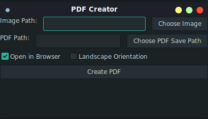

# PDF Creator

A simple application to create A4 PDFs from images.




## Configuration

Edit the `config.json` file to set default values for the application.

## Localization

Localization files are in the `internal/ui/locales` directory. You can add more languages by creating new JSON files and updating the `config.json` file to use the new language.

## Running the Application

1. Install dependencies:
   ```sh
   go mod tidy
   ```
2. Build the application:
   ```sh
   go build -o print-pdf -v ./cmd/print-pdf
   ```
3. Run the application:
   ```sh
   ./print-pdf
   ```